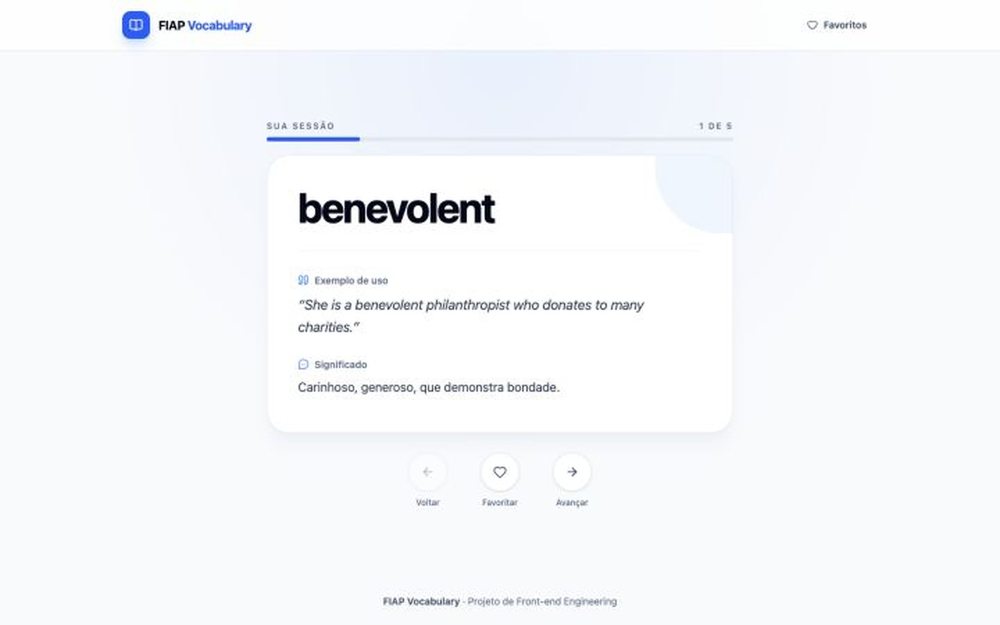
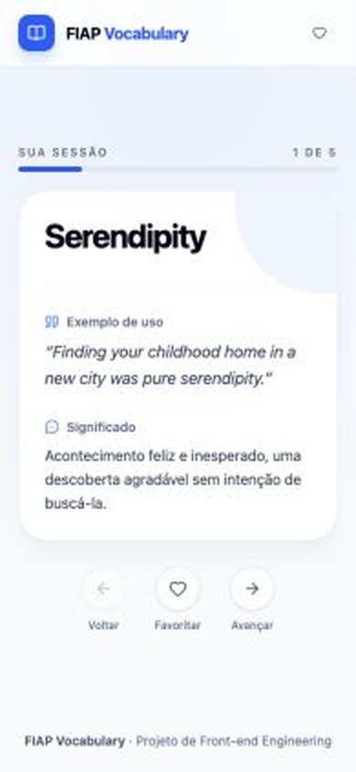
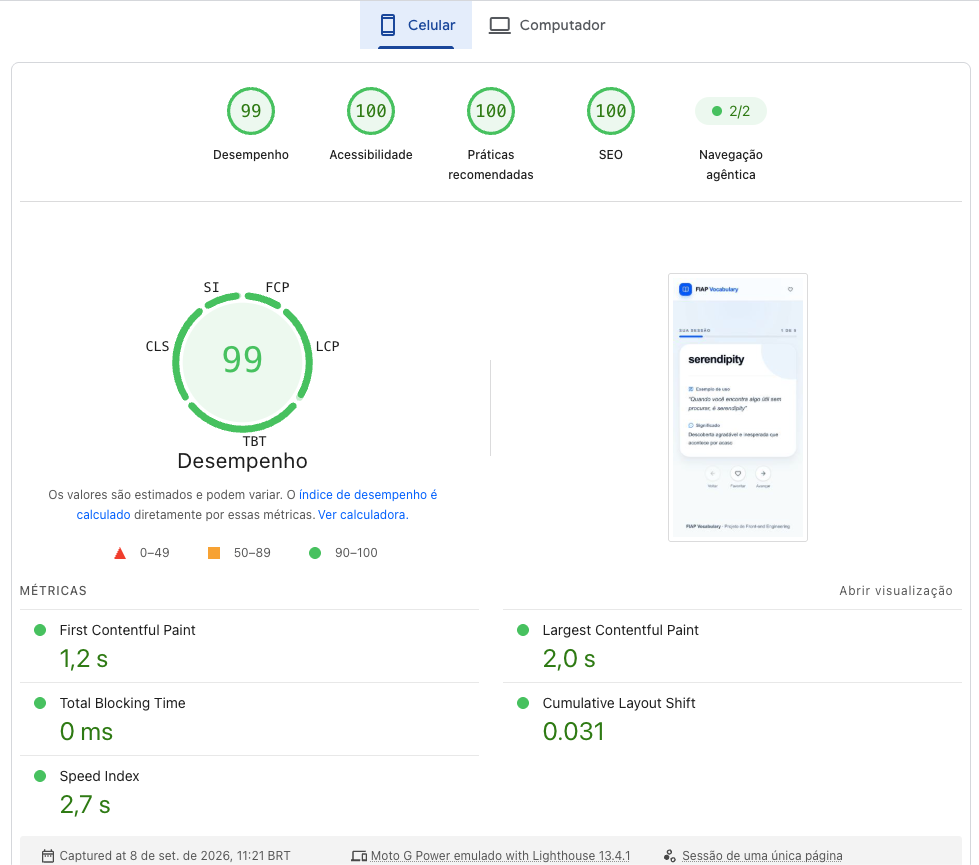
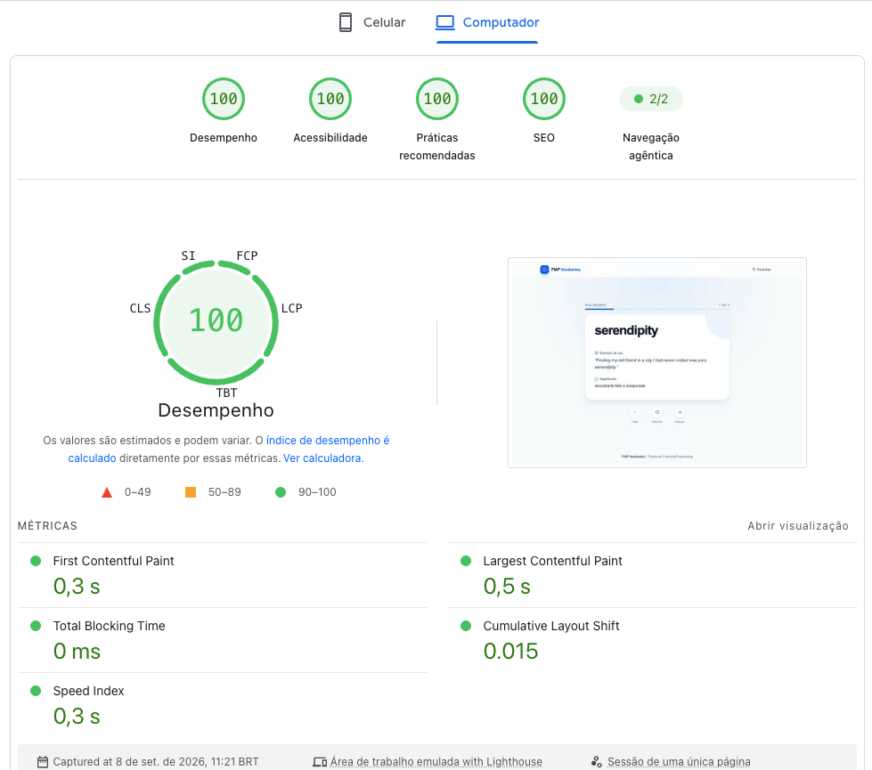

# FIAP Vocabulary Web

Aplicação web desenvolvida para a atividade de Front-end Engineering da FIAP. O projeto consome o FIAP Vocabulary BFF e apresenta cinco palavras distintas em inglês, acompanhadas de explicação em português e exemplo de uso.

## Índice

- [Sobre o projeto](#sobre-o-projeto)
- [Funcionalidades](#funcionalidades)
- [Integração com o BFF](#integração-com-o-bff)
- [Fluxo da aplicação](#fluxo-da-aplicação)
- [Tecnologias](#tecnologias)
- [Como executar](#como-executar)
- [Testes](#testes)
- [Deploy](#deploy)
- [Variáveis de ambiente](#variáveis-de-ambiente)
- [Estrutura do projeto](#estrutura-do-projeto)
- [Demonstração](#demonstração)
- [Web Vitals](#web-vitals)
- [Participantes](#participantes)
- [Referências](#referências)

## Sobre o projeto

O FIAP Vocabulary Web é uma aplicação de apoio ao estudo de inglês. Em cada sessão, o usuário percorre cinco palavras, consulta explicações em português e exemplos de uso em inglês e pode salvar palavras para revisar posteriormente.

O conteúdo é fornecido por um BFF próprio, responsável pela comunicação segura com o Groq e pela validação do resultado. O front-end não acessa diretamente o provedor de IA e não armazena chaves ou outros segredos da API.

## Funcionalidades

- Consulta de cinco palavras distintas em inglês.
- Exibição de uma palavra por vez, com navegação entre os itens da sessão.
- Indicador de progresso e estado de conclusão após a quinta palavra.
- Exibição de explicações em português e exemplos de uso em inglês.
- Adição e remoção de palavras favoritas.
- Página dedicada de favoritos em `/favorites`.
- Persistência dos favoritos no `localStorage` do navegador.
- Interface responsiva e acessível.
- Indicação visual durante o carregamento.
- Prevenção de chamadas duplicadas enquanto uma consulta está em andamento.
- Tratamento de timeout, falha de rede e respostas HTTP de erro.
- Mensagens específicas para limite de requisições e indisponibilidade do serviço.
- Nova tentativa após falhas.
- Validação do contrato recebido antes da apresentação dos dados.

## Integração com o BFF

O front-end consome exclusivamente o endpoint `GET /ask`, sem enviar body ou parâmetros:

```text
GET https://fiap-frontend-engineering-project-b.vercel.app/ask
```

Uma resposta bem-sucedida contém exatamente cinco objetos com os campos `word`, `description` e `useCase`:

```json
[
  {
    "word": "serendipity",
    "description": "Descoberta feliz feita por acaso.",
    "useCase": "Finding this book was pure serendipity."
  }
]
```

Em caso de falha, o BFF responde no seguinte formato:

```json
{
  "error": {
    "code": "GROQ_REQUEST_ERROR",
    "message": "Não foi possível consultar o serviço do Groq."
  }
}
```

A aplicação verifica o status HTTP antes de interpretar a resposta, utiliza a mensagem retornada quando apropriado e possui uma mensagem genérica como fallback. São tratados especialmente erros de rede, timeout e respostas HTTP `429`, `500` e `502`.

Como o BFF retorna as cinco palavras em um único array, a aplicação realiza uma chamada por sessão e apresenta os itens individualmente. Navegar por palavras já recebidas não gera novas requisições.

O código-fonte do BFF está disponível no repositório [FIAP Vocabulary BFF](https://github.com/jlucas577/fiap-frontend-engineering-project-bff).

## Fluxo da aplicação

1. Ao acessar a página inicial, a aplicação solicita uma sessão ao BFF.
2. Durante a requisição, um estado de carregamento é exibido e chamadas duplicadas são impedidas.
3. O usuário navega pelas cinco palavras usando as ações **Voltar** e **Avançar**.
4. A ação **Favoritar** salva ou remove a palavra atual da coleção persistida no navegador.
5. Após avançar a partir da quinta palavra, a aplicação exibe o estado de conclusão sem fazer uma nova requisição.
6. Na rota `/favorites`, o usuário pode consultar ou remover todas as palavras salvas.

Os favoritos são armazenados como objetos completos no `localStorage`, sob a chave `fiap-vocabulary:favorites`. Assim, continuam disponíveis após fechar e abrir novamente o site, mesmo que o BFF gere uma sessão diferente.

## Tecnologias

- React para a construção da interface.
- TypeScript para tipagem estática.
- Vite para desenvolvimento e build.
- Tailwind CSS para estilização responsiva.
- Lucide React para os ícones.
- Fetch API e AbortController para comunicação HTTP e controle de timeout.
- Vitest e Testing Library para testes automatizados.
- ESLint para análise estática do código.

## Como executar

### Pré-requisitos

- Node.js 22 ou superior.
- pnpm.

### Instalação

```bash
git clone https://github.com/jlucas577/fiap-frontend-engineering-project-web.git
cd fiap-frontend-engineering-project-web
pnpm install
cp .env.example .env
```

Preencha a URL pública do BFF no arquivo `.env`:

```dotenv
VITE_BFF_BASE_URL=https://fiap-frontend-engineering-project-b.vercel.app
```

Inicie o ambiente de desenvolvimento:

```bash
pnpm dev
```

O endereço local será exibido pelo Vite no terminal, normalmente `http://localhost:5173`.

Para gerar a versão de produção:

```bash
pnpm build
```

Para visualizar localmente o resultado do build:

```bash
pnpm preview
```

## Testes

Os testes simulam as respostas do BFF e não consomem a cota do Groq nem dependem da API publicada:

```bash
pnpm test
```

Para executar em modo de observação:

```bash
pnpm test:watch
```

Para executar a análise estática:

```bash
pnpm lint
```

A suíte cobre navegação entre palavras, favoritos, conclusão da sessão, tratamento de falhas, nova tentativa, sincronização entre páginas e persistência no navegador.

## Deploy

O projeto pode ser publicado na Vercel, Netlify ou em outra plataforma compatível com aplicações Vite.

### Exemplo na Vercel

1. Publique este repositório no GitHub.
2. Na Vercel, importe o repositório.
3. Confirme o framework **Vite**.
4. Use `pnpm build` como comando de build.
5. Use `dist` como diretório de saída.
6. Cadastre `VITE_BFF_BASE_URL` nas variáveis do projeto.
7. Faça o deploy e cadastre a URL pública do front-end em `CORS_ORIGIN` no BFF.

### URLs públicas

- Front-end: <https://fiap-frontend-engineering-project-w.vercel.app/>
- BFF: <https://fiap-frontend-engineering-project-b.vercel.app/>
- Repositório do BFF: <https://github.com/jlucas577/fiap-frontend-engineering-project-bff>

## Variáveis de ambiente

| Variável | Obrigatória | Padrão | Descrição |
| --- | --- | --- | --- |
| `VITE_BFF_BASE_URL` | Sim | - | URL pública do BFF, sem o caminho `/ask`. |

Variáveis prefixadas com `VITE_` são incorporadas ao bundle e ficam visíveis no navegador. Por isso, nenhuma chave ou informação sensível deve ser armazenada nelas. A única configuração necessária no front-end é a URL pública do BFF; as credenciais do provedor de IA pertencem exclusivamente ao backend.

## Estrutura do projeto

```text
src/
├── components/    # Cards, navegação e estados reutilizáveis
├── hooks/         # Sessão, navegação e persistência de favoritos
├── pages/         # Página dedicada de favoritos
├── services/      # Comunicação e validação do contrato do BFF
├── test/          # Configuração dos testes
├── types/         # Tipos compartilhados
├── App.test.tsx   # Testes dos principais fluxos
├── App.tsx        # Composição e navegação da aplicação
├── main.tsx       # Inicialização da aplicação
└── styles.css     # Tailwind CSS e estilos globais
```

## Demonstração

### Computador



### Celular



## Web Vitals

A versão publicada foi analisada pelo PageSpeed Insights em 8 de setembro de 2026, utilizando o Lighthouse 13.4.1. Os resultados abaixo são métricas de laboratório e podem variar conforme dispositivo, rede e momento da medição.

### Resultados

| Perfil | Desempenho | Acessibilidade | Práticas recomendadas | SEO |
| --- | ---: | ---: | ---: | ---: |
| Celular | 99 | 100 | 100 | 100 |
| Computador | 100 | 100 | 100 | 100 |

| Métrica | Celular | Computador |
| --- | ---: | ---: |
| First Contentful Paint (FCP) | 1,2 s | 0,3 s |
| Largest Contentful Paint (LCP) | 2,0 s | 0,5 s |
| Total Blocking Time (TBT) | 0 ms | 0 ms |
| Cumulative Layout Shift (CLS) | 0,031 | 0,015 |
| Speed Index | 2,7 s | 0,3 s |

#### Celular



#### Computador



### Significado das métricas

As principais métricas avaliadas incluem:

- **Largest Contentful Paint (LCP):** tempo necessário para exibir o maior elemento de conteúdo visível.
- **Interaction to Next Paint (INP):** capacidade da página de responder visualmente às interações do usuário.
- **Cumulative Layout Shift (CLS):** estabilidade visual da página durante o carregamento.
- **First Contentful Paint (FCP):** tempo até a exibição do primeiro conteúdo na tela.
- **Speed Index:** velocidade com que o conteúdo visível é apresentado.
- **Total Blocking Time (TBT):** tempo em que a thread principal permanece bloqueada e não responde às interações.

O INP não aparece nos resultados de laboratório acima porque depende de dados de uso real. No Lighthouse, o TBT funciona como uma aproximação da capacidade de resposta durante o carregamento.

## Participantes

| Nome | Matrícula |
| --- | --- |
| Ana Carolina Domingos Moreira | RM368399 |
| Bruno Bergamasco de Azevedo | RM367485 |
| João Lucas Martins de Almeida | RM368253 |
| Rafael da Costa Fonseca | RM368026 |
| Roberto Dias da Cruz Maia | RM368380 |

## Referências

- [Como escrever um README no GitHub — Alura](https://www.alura.com.br/artigos/escrever-bom-readme)
- [Documentação do React](https://react.dev/)
- [Documentação do Vite](https://vite.dev/guide/)
- [Variáveis de ambiente no Vite](https://vite.dev/guide/env-and-mode)
- [Web Vitals](https://web.dev/articles/vitals)
- [Lighthouse](https://developer.chrome.com/docs/lighthouse/overview)
- [Repositório do FIAP Vocabulary BFF](https://github.com/jlucas577/fiap-frontend-engineering-project-bff)
